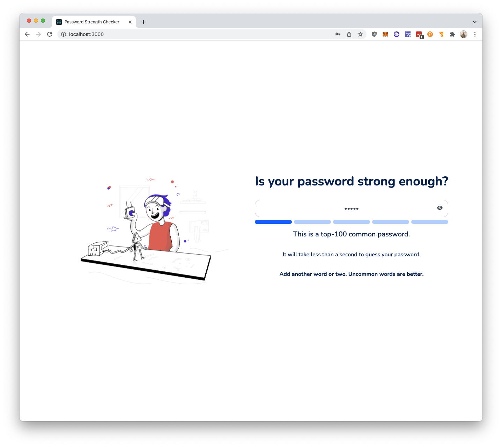
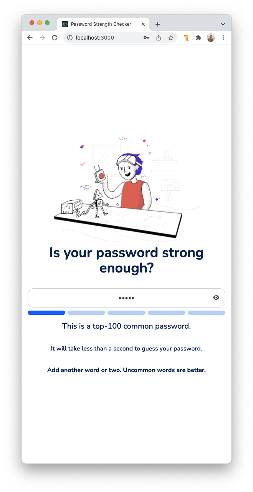

# Password Strength Checker

A micro web app for estimating the password strength written in ReactJS and Typescript.

## Table of Contents

- [Password Strength Checker](#password-strength-checker)
  - [Preview](#preview)
    - [Desktop Preview](#desktop-preview)
    - [Mobile Preview](#mobile-preview)
  - [Technologies Used](#technologies-used)
  - [Requirements](#requirements)
  - [Installation](#installation)
    - [1. Install the node dependencies](#1-install-the-node-dependencies)
    - [2. Setup environment variables](#2-setup-environment-variables)
      - [a. Create `.env` file in root project directory and add the following contents](#a-create--env--file-in-root-project-directory-and-add-the-following-contents)
    - [3. Setup done](#3-setup-done)
  - [Starting the server](#starting-the-server)
    - [1. In a terminal, execute the command `npm start` or `yarn start`](#1-in-a-terminal--execute-the-command--npm-start--or--yarn-start-)
    - [2. Using a browser, visit `http://localhost:3000`](#2-using-a-browser--visit--http---localhost-3000-)
  - [Starting the server using Docker](#starting-the-server-using-docker)
    - [1. Build docker image](#1-build-docker-image)
    - [2. Run docker image](#2-run-docker-image)
  - [Author](#author)
  -

## Preview

### Desktop Preview



### Mobile Preview



## Technologies Used

- ReactJS
- TailwindCSS
- Typescript
- Lottie
- Docker

## Requirements

- node.js v17 (17.0.1 recommended)
- npm v8 (8.1.0 recommended)
- Docker (optional)

## Installation

### 1. Install the node dependencies

```bash
# in root project directory
npm install # or yarn install
```

### 2. Setup environment variables

#### a. Create `.env` file in root project directory and add the following contents

```
REACT_APP_API_HOST=https://o9etf82346.execute-api.us-east-1.amazonaws.com/staging
```

### 3. Setup done

## Starting the server

### 1. In a terminal, execute the command `npm start` or `yarn start`

### 2. Using a browser, visit `http://localhost:3000`

## Starting the server using Docker

### 1. Build docker image

```bash
docker build -t password-strength-checker .
```

### 2. Run docker image

```bash
docker run -dp 3000:3000 password-strength-checker
```

## Author

Kristian Espina
